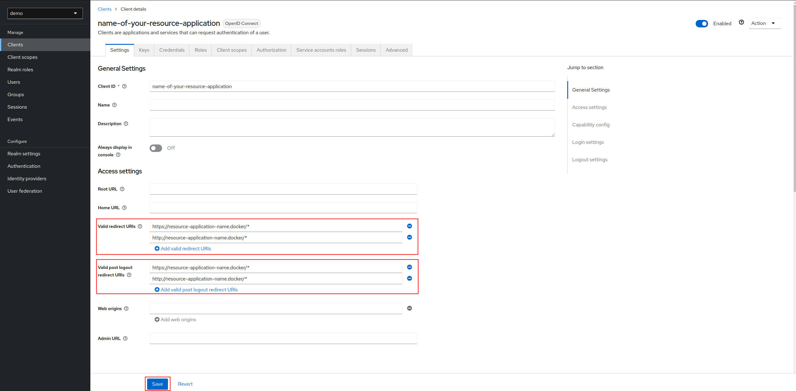
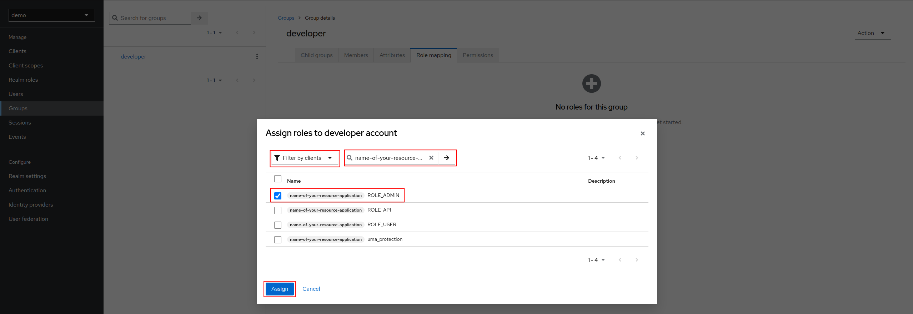
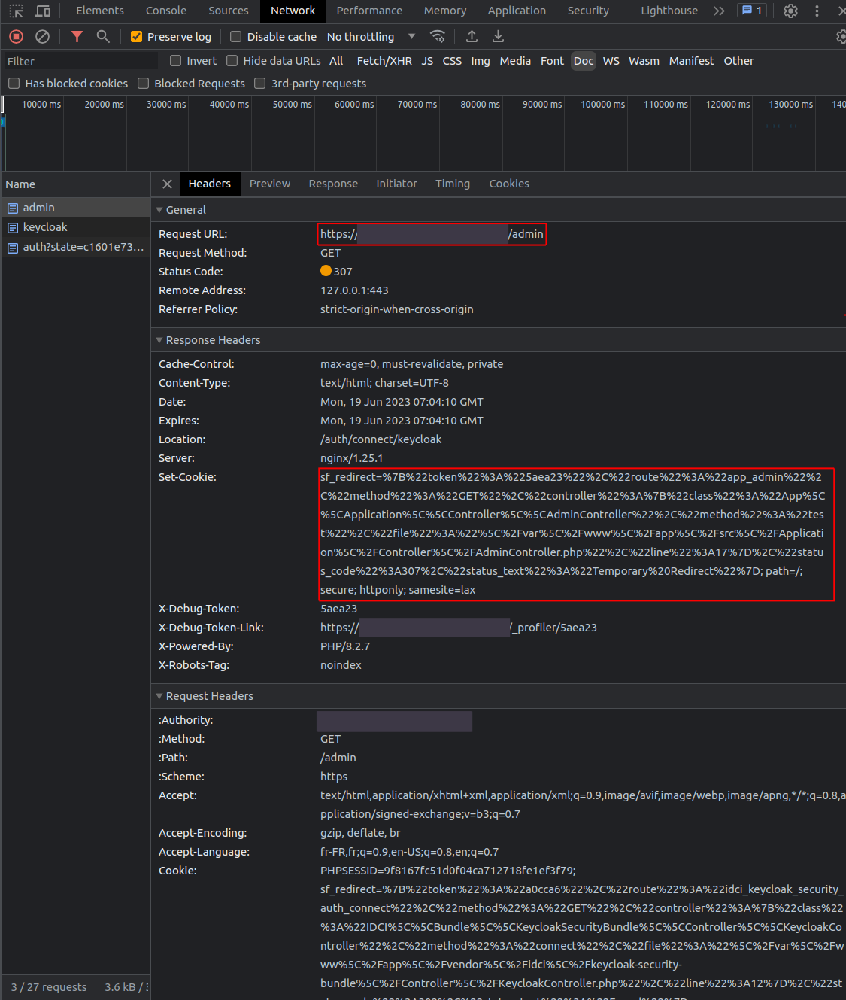
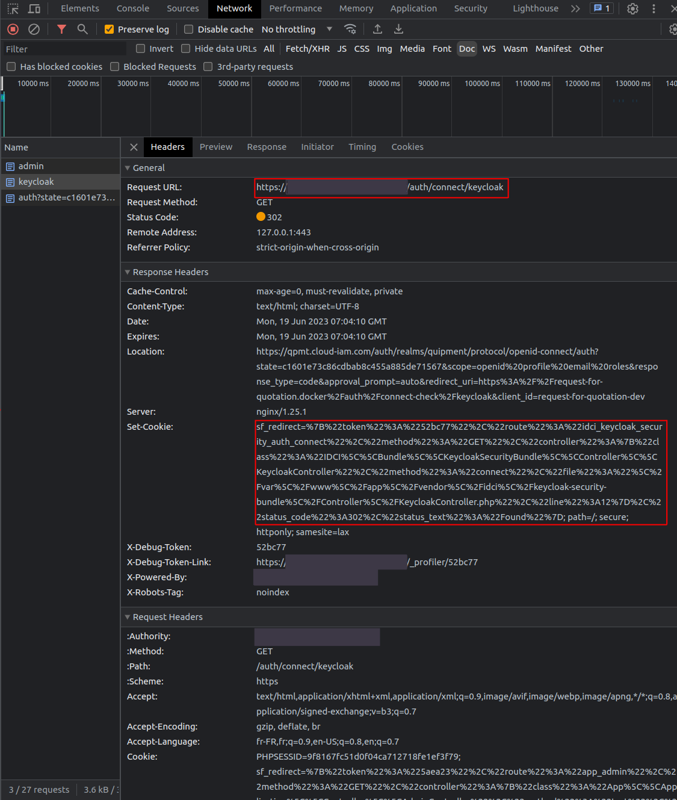
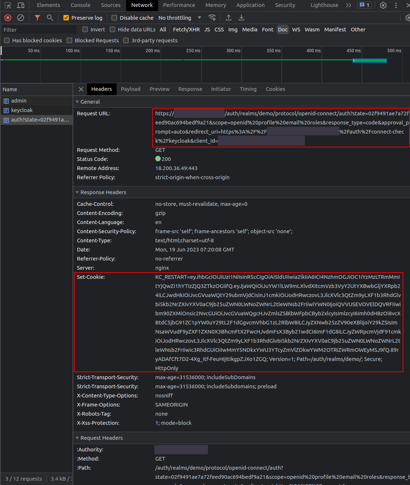
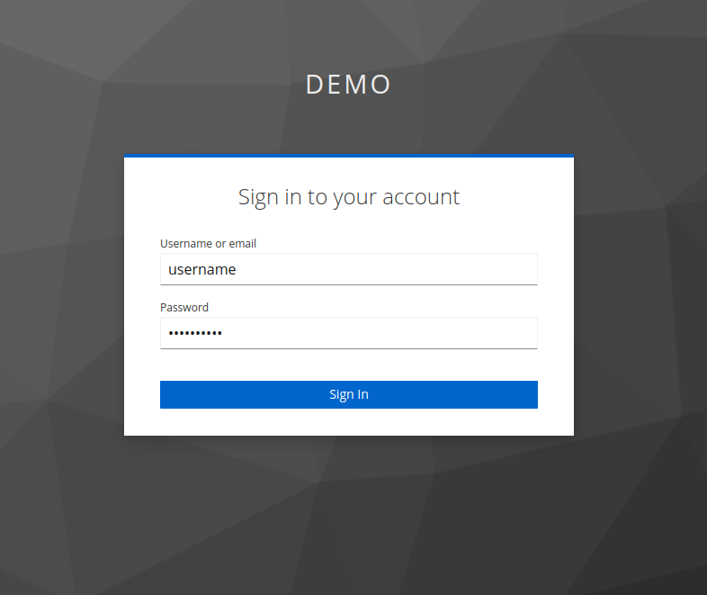
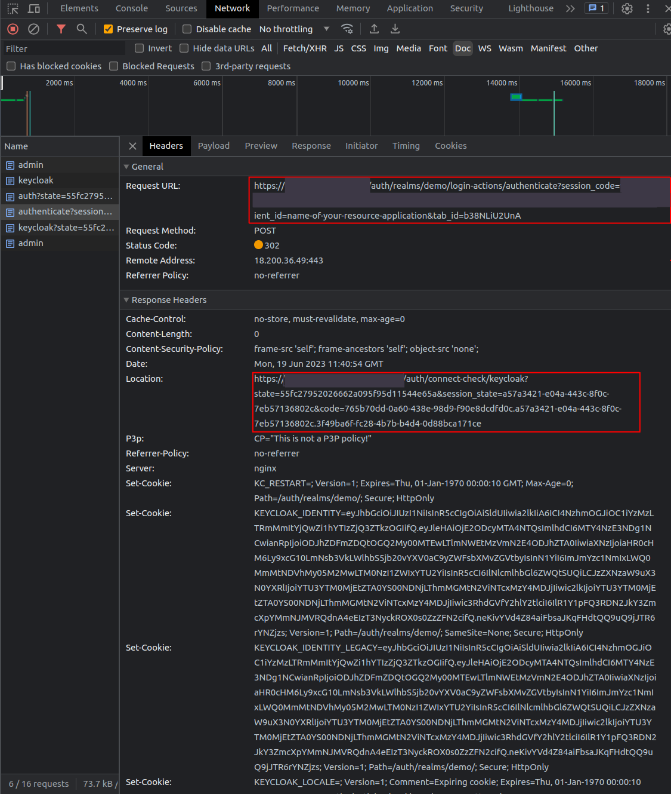
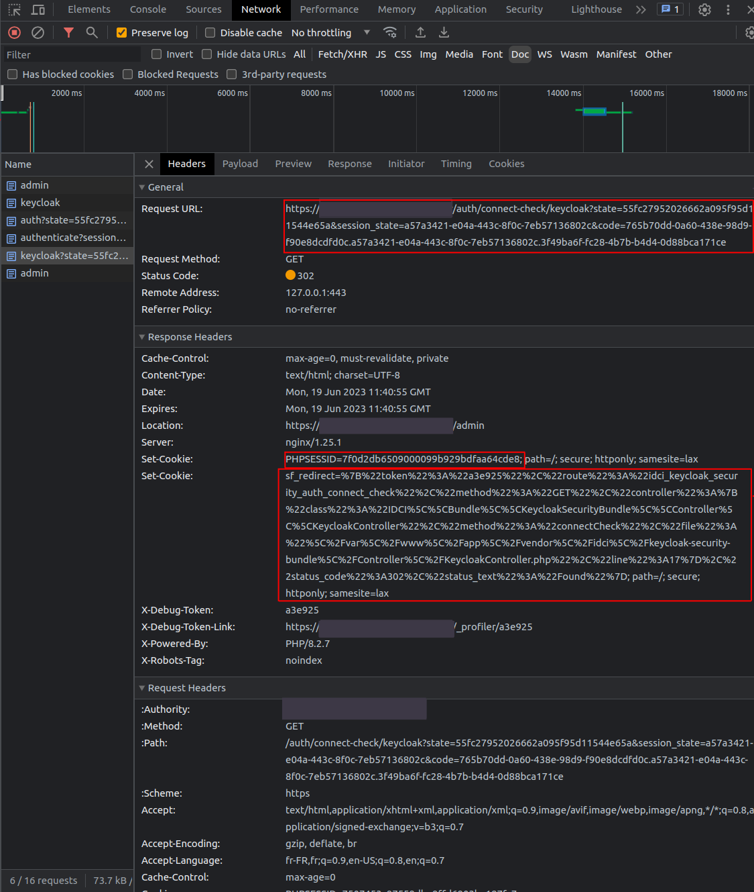
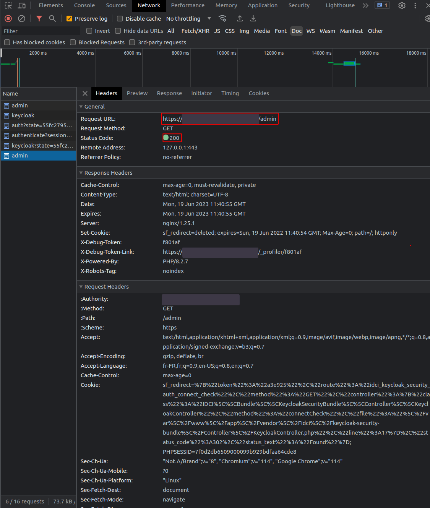
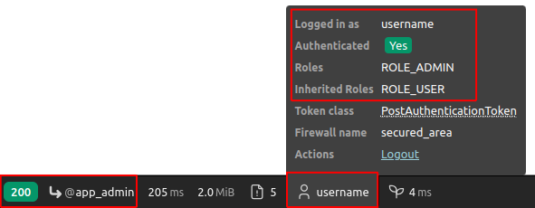

How to configure an user authorization request with Keycloak and your Symfony project
=====================================================================================

---

Synopsis + schema

---

## Requirements section

First of all, a realm named `demo` must exists and you have to create a client.

You can use our [tutorial to help you to create your client](./keycloak-help-guide-client-configuration.md)

---

# Keycloak - Configuration

## Allow valid redirect URIs

Fill **Valid redirect URIs**, **Valid post logout redirect URIs** and click on **Save**:



## Client roles creation

We are going to create roles "ROLE_ADMIN" and "ROLE_USER" for our client application.

Click on **Create role**:


Fill **Role name** and click on **Save**.


Your roles have been created successfully!

## User creation

We are going to create a group with the previous client role "ROLE_ADMIN".
Then we will create a user and add this one in the previous group.

1. Group creation

Click on **Groups** on left panel:


Click on **Create group**:


Fill **name** and click on **Create**:


Your group has been created successfully!

Click on developer group:


In **Role mapping** tab, click on **Assign role**:


Click on **Filter by clients**, search name-of-your-resource-application, check ROLE_ADMIN and click on **Assign**:




Your role has been mapped successfully on developer group!

2. User creation

Click on **Users** on left panel:


Click on **Add user**:


Fill **Username**, **Email**, **First name**, **Last name** and check **Email verified**:


Your user has been created successfully!

3. Set user password

Click on **Credentials** tab and on **Set password**:


Set password and click on Save:


4. Add user in developer group

Click on **Members** tab and on **Add member**:


Select user and click on **Add**:


Your user has been successfully added in developer group!

---

# Symfony - Configuration

## Configure env file

For KEYCLOAK_SERVER_BASE_URL, you need to put your keycloak URL (something like https://keycloak/auth).

For KEYCLOAK_CLIENT_SECRET, you need to copy secret present in your client name-of-your-resource-application for example:


In .env file, update:
```yaml
###> idci/keycloak-security-bundle ###
KEYCLOAK_SERVER_BASE_URL=https://keycloak/auth
KEYCLOAK_SERVER_PUBLIC_BASE_URL=${KEYCLOAK_SERVER_BASE_URL}
KEYCLOAK_SERVER_PRIVATE_BASE_URL=${KEYCLOAK_SERVER_BASE_URL}
KEYCLOAK_REALM=demo
KEYCLOAK_CLIENT_ID=name-of-your-resource-application
KEYCLOAK_CLIENT_SECRET=client_secret
###< idci/keycloak-security-bundle ###
```

## Configure security

```yaml
# config/packages/security.yaml
imports:
    # Import Keycloak security providers
    - { resource: '@IDCIKeycloakSecurityBundle/Resources/config/security.yaml' }

security:

    enable_authenticator_manager: true
    firewalls:

        # This route create the OAuth 2 "User Authorization Request" and must be accessible for unauthenticated users
        auth_connect:
            pattern: /auth/connect/keycloak
            security: false

        # Here is an exemple to protect your application (UI) using OAuth 2 Authorization Code Flow
        secured_area:
            pattern: ^/
            provider: idci_keycloak_security_provider
            entry_point: IDCI\Bundle\KeycloakSecurityBundle\Security\EntryPoint\AuthenticationEntryPoint
            custom_authenticators:
                - IDCI\Bundle\KeycloakSecurityBundle\Security\Authenticator\KeycloakAuthenticator
            logout:
                path: idci_keycloak_security_auth_logout

    role_hierarchy:
        ROLE_ADMIN: ROLE_USER

    access_control:
        # This following ROLES must be configured in your Keycloak client
        - { path: ^/admin, roles: ROLE_ADMIN }
```

---

# Result

With your browser, go to https://your-symfony-application-URL/admin

If you open Network tab of inspector of your browser, you will see 3 routes:

1. /admin:



This route is redirected to /auth/connect/keycloak (provided by our bundle)

2. /auth/connect/keycloak



This route is redirected to your Keycloak auth route

3. /auth/realms/demo/protocol/openid-connect/auth



A Keycloak login prompt will be displayed. You need to fill with username and password created:



After, click on ***Sign In***, in Network tab of inspector of your browser, you will see 3 new routes:

1. /auth/realms/demo/login-actions/authenticate?session_code=



This route is redirected to /auth/connect-check/keycloak (provided by our bundle)

2. /auth/connect-check/keycloak



This route sets of PHPSESSID and is redirected to https://your-symfony-application-URL/admin.

3. /admin





Congrats, you are connected by your Symfony application through Keycloak!
